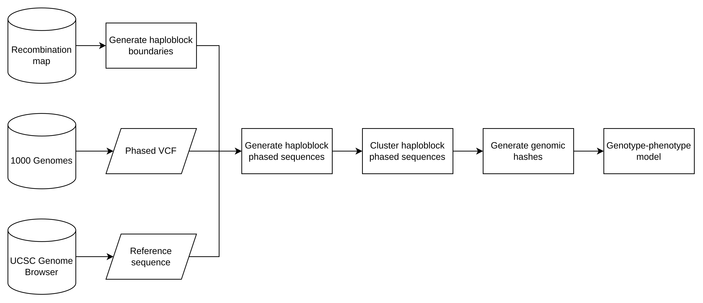
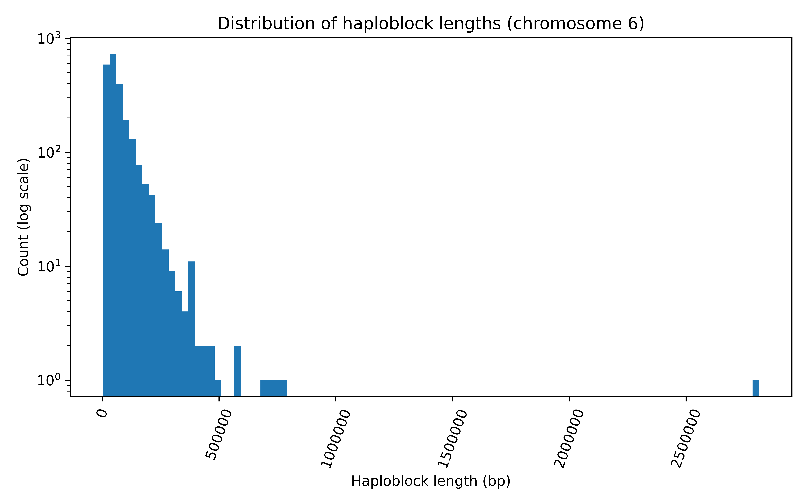

# Abstract

**Background**: Despite the easy and affordability of genome sequencing in biomedical research, the genetic causes of many diseases or their subtypes remain unknown due to diverse biological mechanisms that complicate genotype-phenotype relationships. Most previous studies have focused on single variants or sets of variants presumed to be directly causal for the disease. However, incomplete penetrance, in which some individuals carry disease-associated variants yet exhibit no phenotype, suggests that these variants, genomic background, and other secondary factors combine to shape the susceptibility to the disease.

**Results**: Here, we introduce a new methodology for genotype-phenotype mapping based on genomic hashes, which are unique representations of the local genomic background. Each hash corresponds to a haplotype-resolved set of variants within one recombination-defined genomic region (haploblock). We provide a practical guide for using genomic hashes to train machine learning models that link genomic background and specific variant sets to phenotypic outcomes. We implemented this framework as a ready-to-use bioinformatics pipeline capable of fast, scalable, hash-based genome comparison. The pipeline is available on GitHub: https://github.com/collaborativebioinformatics/Haploblock_Clusters_ElixirBH25

**How it benefits the community**: Genomic hashes offer a computationally efficient framework for large-scale genotype-phenotype mapping. By discretizing the genome into haploblocks, this approach will facilitate the search for causes of complex phenotypes across the entire genome and prediction of precision prevention points and treatments.

# Introduction

Genomics research has improved the understanding of disease mechanisms by uncovering complex relationships between genetic variation, environmental factors and clinical phenotypes. Many studies have identified severe and early-onset conditions arising from monogenic risk variants that disrupt physiological pathways and directly cause disease [@Guadagnolo2021-mf; @Guerrini2021-kb]. However, a part of the unexplained mechanisms stems from interactions among multiple genetic factors. Multigenic traits are shaped by the interplay between several variants that combine to cause disease, often within the same gene or pathway, making them difficult to study [@Chatelain2021-to]. Epistatic effects occur when the effect of one variant on the phenotype depends on another, for instance, when one SNP (single nucleotide polymorphism) affects the penetrance of another SNP, when a structural variant influences the penetrance of a SNP (or vice versa), or when a variant-encoded protein impacts the function of another protein within a pathway. Emerging evidence suggests that disease risk is shaped by multiple levels of molecular variation in nonlinear and interactive ways [@Ritchie2015-xi; @Vuckovic2020-tm]. In rare diseases and cancer, carriers of high-penetrance variants with high polygenic risk show greater disease risk compared to those with low polygenic risk [@Fahed2020-ha; @Hassanin2023-jd]. Polygenic risk scoring has been used to estimate the penetrance of monogenic risk variants and determine individual-level liability to autism spectrum disorder [@Klei2021-wq], diabetes [@Murray-Leech2025-no] or Parkinson’s disease [@Kmiecik2024-jh]. These pathogenic variants and the polygenic background jointly contribute to disease risk, but their effects are additive and independent [@Oetjens2019-ii]. In addition, environmental factors acting through epigenomics or molecular signaling can also mediate the contribution of genomic variants to phenotypes, such as body weight and diabetes [@Marderstein2021-ib].

Many healthy individuals carry pathogenic variants associated with diseases, however, they exhibit no phenotype. Previous studies suggest that this significant variability of clinical outcomes is determined not only by high-penetrance variants, but also by complex relationships between such variants, genomic background and other secondary factors [@Chami2020-yi; @Hassanin2023-jd; @Njoroge2022-dg; @Timpson2018-oc]. This variability might be driven by the genomic background itself, involving many common variants with small effects that combine to shape the function of physiological pathways [@Tonner2022-iv]. To date, however, there has not been a systematic approach to understanding the effect of genomic background on phenotypic outcomes. This complexity necessitates the development of new computational methods capable of capturing these interactions between multiple factors and phenotypes, which will reveal new opportunities for effective personalized treatments.

Recent advancements in genome sequencing have enabled many studies on the diversity of the human population [@Liao2023-zg; @Logsdon2025-yt]. This diversity arises due to recombination, a process whereby some sets of variants are exchanged during reproduction. The frequency of recombination is not uniform across the genome; certain regions have substantially higher recombination frequencies compared to their surroundings – these are recombination hotspots. Haploblocks, the regions between recombination hotspots, exhibit highly conserved patterns of allele inheritance. The availability of large-scale genomic datasets and biobanks, which grant access to data from numerous individuals across diverse populations and generations, provides a strong foundation for reliable and accurate analyses of inheritance patterns. Until recently, studies estimating recombination frequencies were constrained by the challenges of studying human populations, resulting in incomplete and inaccurate genetic maps. New recombination maps, however, are sufficiently accurate to approximate haploblock boundaries across the human genome [@Halldorsson2019-po; @Palsson2025-cw]. This will improve the understanding of multi-allelic inheritance patterns underlying complex phenotypic traits and diseases [@Wang2023-vv; @Zhang2023-wt].

Here, we propose a new methodology to empirically define genome-wide variant clusters within and across haploblocks, implemented as a fast and scalable bioinformatics pipeline. Integrating haploblock signatures into genotype-phenotype mapping provides a unified approach to investigating which specific sets of variants contribute to complex phenotypic traits. It will support further studies on both continuous phenotypic traits (e.g., human height, anxiety-related quantitative scores) and categorical disease subtypes, such as those observed in Alzheimer’s disease or cancer.

# Methods

The aim of this framework is to cluster individuals based on their genomic background and associate these clusters with specific phenotypic outcomes. We expect that each cluster will be characterized by a specific combination of variants that jointly predispose individuals to a particular disease subtype. However, clustering individuals using whole-genome sequences is unfeasible due to computational limitations. Therefore, we divide the human genome into haploblocks based on recombination rates and cluster individuals’ genomic sequences within these regions. This approach is both computationally efficient, allowing parallel clustering, and biologically grounded, as haploblocks show high multi-allelic inheritance patterns. Consequently, specific combinations of variants that predispose individuals to disease are likely contained within, rather than spread across, haploblocks. To scale this framework to large genomic and phenotypic datasets, we developed an automated, parallelized computational pipeline. This pipeline will allow the search for new disease-associated combinations of variants and promising drug targets on a population scale, potentially facilitating personalized interventions before disease onset.

## Data

In this study, we used a high-resolution recombination map from Halldorsson et al., 2019 with empirically defined recombination rates, averaged across maternal and paternal genomes. The map was constructed using microarray genotype and whole-genome sequence data on parent-child pairs. For detailed information on sample size, population demographics, and other technical specifications, refer to Halldorsson et al. (2019). We used population-level variant data from the 1000 Genomes Project, which contains 2,548 individuals across 26 populations [@Fairley2020-zi]. We also used the reference sequence for chromosome 6 (GRCh38) downloaded via the UCSC Genome Browser (http://genome.ucsc.edu) [@Perez2025-us]. These data were further utilized in various steps of the pipeline, as described below.

## Implementation

The pipeline consists of three main components to enable genotype-phenotype mapping: background haploblock clustering, a cluster labeling scheme, and predictive modeling (**Fig. 1**).

\
**Fig. 1.** Workflow of the pipeline.

#### Background haploblock clustering

The pipeline begins by identifying haploblock boundaries using Gaussian smoothing, which averages recombination rates across nearby genomic positions to produce a smoothed curve. Local peaks in this curve define haploblock boundaries. Then individual genomic sequences are generated for each haploblock by projecting variant data onto the reference sequence. The resulting haploblock sequences are clustered based on sequence similarity using MMseqs2 [@Steinegger2017-sd]. Parameters for clustering are calculated as follows: minimum alignment score is the proportion of variants within each haploblock relative to the total haploblock length; minimum sequence coverage is the ratio of haploblock length to the resolution of the genetic map.

#### Cluster Labeling Scheme

Each individual is assigned a unique hash in a standardized format: a 64-character binary string (0s and 1s) that encodes DNA strand (4 characters), chromosome (10 characters), haploblock (20 characters), cluster (20 characters), and ten predefined variants of interest. Each hash encodes haploblock-specific patterns of variant co-occurrence for every individual. This ensures that local genomic background can be uniquely represented, enabling downstream analyses across datasets.

#### Predictive Modeling

Using these binary representations, we can construct predictive models that capture complex genotype–phenotype relationships and classify individuals into distinct etiological subtypes based on their genomic hashes. A simple model to relate the phenotype $y_i$ with our haploblock-specific hashes $x_{ih}$ is a weighted linear model as follows:

$y_i = \beta_0 + \sum_{h=1}^{H}{\alpha_{ih} (x^T_{ih}U_h)}$

where:
- $x_{ih} \in \mathbb{R}^d$ is the binary vector for haploblock $h$ and individual $i$
- $y_i$ is the phenotype for individual $i$
- $U_h \in \mathbb{R}^{d}$ is the projection vector for each haploblock $h$ across individuals
- $\alpha_{ih}$ is a haploblock-specific weight for each individual
- $\beta_0$ is the zero-intercept

The parameters $\beta_0$, $\alpha_{ih}$ and the haploblock-specific projection vectors $U_h$ are learned using gradient descent optimization with mean squared error loss. Thsis linear model enables each haploblock to contribute through a learnable projection vector $U_h$ and scalars $\alpha_{ih}$, capturing individual-specific haploblock weights. We initialize the weights $\alpha_{ih}$ using summary statistics of p-values derived from GWAS studies over the SNPs of interest.

Note that this is a simple model sketch illustrating how binary hashes can be used for predictive modeling. The model can be extended in various directions; for example, one could learn decision trees on these binary vectors based on SNP occurrence within each haploblock in a hierarchical manner.

# Results

We ran the pipeline as described in the Methods section for chromosome 6 data from 26 populations in the 1000 Genomes Project (2,548 individuals). We identified 2,288 haploblocks of varying lengths: most haploblocks were under 50 kb, however, several exceed 250 kb, reflecting the diversity of population-scale recombination patterns (**Fig. 2**). For the full list of haploblock boundaries, refer to the GitHub repository.

\
**Fig. 2.** Distribution of haploblock lengths in chromosome 6.

We generated haploblock phased sequences with common variants (minimum allele frequency > 0.05; coverage mode 2 to eliminate artifact fragments i.e., short sequences) for the following genomic regions in chromosome 6: five randomly selected haploblocks, haploblock overlapping with TNFa (chr6:31,575,565-31,578,336) and haploblock overlapping with HLA-A (chr6:29,941,260-29,945,884). We performed sequence clustering separately for three populations: Han Chinese in Beijing (CHB), British in England and Scotland (GBR) and Puerto Rican in Puerto Rico (PUR), and then for the full set of 26 populations from the 1000 Genomes Project. We compared the number of clusters for two genomic regions, TNFa and HLA-A, highlighting the number of clusters with a single representative (**Table 1**).

**Table 1.** Number of identified clusters for three representative populations (CHB: Han Chinese in Beijing, GBR: British in England and Scotland, PUR: Puerto Rican in Puerto Rico) and for the full 1000 Genomes dataset (26 populations). The numbers of clusters with only single representatives are in parentheses.

| Region | CHB     | GBR    | PUR     | 26 populations |
|--------|---------|--------|---------|----------------|
| TNFa   | 5       | 6 (2)  | 11 (2)  | 140 (479)      |
| HLA-A  | 10 (21) | 8 (14) | 12 (10) | 47 (1604)      |

For TNFa, the number of clusters is smaller within individual populations (5 in CHB, 6 in GBR and 11 in PUR) but increases to 140 when 26 populations are analyzed together.  By contrast, for HLA-A, although the number of clusters within single populations is comparable to TNFa (10 in CHB, 8 in GBR and 12 in PUR), the number of clusters across 26 populations is lower (47). These results serve as a proof of concept, showing that sequence clustering within and across haploblocks can capture differences in population structure.

In addition, we performed performance tests on a haploblock overlapping with TNFa using all samples (**Table 2**).

**Table 2.** Runtime of individual pipeline steps for a single haploblock (TNFa) with the comparison of Hackathon CPU and Optimized CPU implementations. The benchmark was performed on an AWS Linux–based system with 128 CPU cores, 480 GB of memory and 1 NVIDIA A100 GPU with 80 GB of VRAM (instance type: hyperstack_A100_80Gx4).

| Step | Hackathon (CPU) [s] | Optimized (CPU) [s] | CPU speed-up |
|------|--------------------|--------------------|--------------|
| 1    | 1.27               | 1.93               | 0.66x        |
| 2    | 591.96             | 10.13              | 58.4x        |
| 3    | 189.86             | 5.83               | 32.6x        |
| 4    | 346.26             | 243.14             | 1.42x        |
| 5    | 0.21               | 1.96               | 0.11x        |

# Conclusions

Predicting effective treatments for complex phenotypic outcomes based on genotype has always been the objective of genomics research. To date, however, translating biological insights into clinical strategies still constitutes a challenge [@Timpson2018-oc; @Visscher2021-ol]. In this study, we introduce a new methodological framework for genotype-phenotype mapping based on genomic hashes. We tested our method by clustering sets of variants within haploblocks of chromosome 6. Our results highlight the potential of hash-based haploblock clustering as a fast and scalable computational approach for deconvoluting complex genotype-phenotype relationships. While this study is limited to chromosome 6 and serves as a proof of concept, this framework can be extended to other genomic regions and larger genotype and phenotype datasets to explore genotype-phenotype associations.

# Future directions

# Data and software availability

The 1000 Genomes Project data is available at: https://ftp.1000genomes.ebi.ac.uk/vol1/ftp/data_collections/1000_genomes_project/

The reference sequence for chromosome 6 (GRCh38) is available at: https://hgdownload.soe.ucsc.edu/goldenPath/hg38/chromosomes/

The genetic map with genome-wide recombination rates from Halldorsson et al., 2019 is available at: https://www.science.org/doi/10.1126/science.aau1043

Samtools, BCFtools and HTSlib are available under the CC BY-NC-ND 4.0 license at: https://www.htslib.org/. MMSeqs2 is available under the MIT license at: https://github.com/soedinglab/MMseqs2

Our software is available under the MIT license on GitHub (https://github.com/collaborativebioinformatics/Haploblock_Clusters_ElixirBH25).

# Competing interests

Ben Busby is a full time employee of NVIDIA, Inc. 

# Grant information

Jędrzej Kubica is supported by the France 2030 state funding managed by the National Research Agency with the reference "ANR-22-PEPRSN-0013". Dariusz Plewczynski, Krzysztof Banecki were supported by Warsaw University of Technology within the Excellence Initiative: Research University (IDUB) programme. This work has been co-supported by Polish National Science Centre (2020/37/B/NZ2/03757). Hetvi Jethwani is supported by the EPSRC Centre for Doctoral Training in Modern Statistics and Statistical Machine Learning and Imperial College London with the reference 2748969. Mauricio Moldes received no specific grant from any funding agency; participation was supported by the Department of Genomic Medicine, Rigshospitalet.

# Acknowledgements

This work was supported by ELIXIR, the research infrastructure for life science data, and conducted at the ELIXIR BioHackathon Europe. We thank the organizers of the ELIXIR BioHackathon, as well as EMBL for funding the hackathon. HJ acknowledges funding support from the Open Bioinformatics Foundation for the hackathon. MM acknowledges the support of the Department of Genomic Medicine, Rigshospitalet. We thank Nikita Kozlov for reviewing and providing constructive feedback on the manuscript.

# References